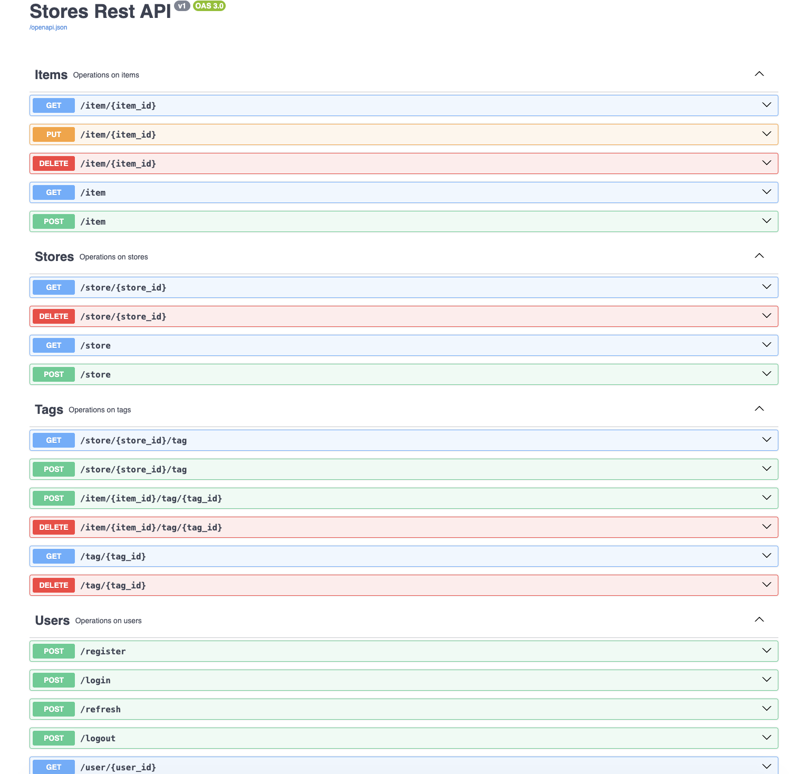

# Store Management API

A RESTful API built with **Python and Flask** for managing a stores, items, and users.

This API provides endpoints for typical store operations such as user authentication, store management, item tracking, and more. It is suitable for backend use in mobile apps, or web dashboards.

## 🚀 Features

- **User Authentication** (JWT token based)
- **Product CRUD** operations
- **Inventory Management**
- **Database Migrations**
- **Docker support**
- Clean project structure with models, schemas, and resource modules

## 🧠 Technology Stack

- Python 3.x
- Flask (REST API)
- Flask-Migrate / Alembic (migrations)
- SQLAlchemy (ORM)
- Marshmallow (serialization / validation)
- PostgreSQL / SQLite (configurable via settings)
- Docker & Docker-Compose

## 📁 Project Structure
```text
store-management-api/
├── app.py
├── db.py
├── settings.py
├── schemas.py
├── models/
├── resources/
├── migrations/
├── Dockerfile
├── docker-compose.yml
├── docker-entrypoint.sh
├── requirements.txt
├── blocklist.py
└── tasks.py
```


## 🛠️ Getting Started

### Prerequisites

Make sure you have the following installed:

- Python 3.8+
- `pip` package manager
- Docker & Docker Compose (optional but recommended)

### Local Setup

1. **Clone the repository**

    ```bash
    git clone https://github.com/Dhara0611/store-management-api.git
    cd store-management-api

2. **Create & activate a virtual environment**

    ```bash
    python -m venv venv
    source venv/bin/activate      # macOS/Linux
    venv\Scripts\activate         # Windows

3. **Install dependencies**

    ```bash
    pip install -r requirements.txt

4. **Configure environment variables**

    ```bash
    FLASK_ENV=development
    DATABASE_URL=sqlite:///store.db
    SECRET_KEY=your_secret_key
    JWT_SECRET_KEY=your_jwt_secret

5. **Run the app**

    ```bash
    flask run

By default the API will be available at:
➡️ http://localhost:5000

🐳 Using Docker (Optional)
Build and start the app via Docker:

    docker compose up --build


## 📦 API Endpoints

#### 👥 Users

| Method | Endpoint    | Description           |
| ------ | ----------- | --------------------- |
| POST   | `/register` | Register new user     |
| POST   | `/login`    | Login and get JWT     |
| POST   | `/logout`   | Logout / revoke token |

#### 🛒 Stores

| Method | Endpoint      | Description          |
| ------ | ------------- | -------------------- |
| GET    | `/store`      | List stores          |
| POST   | `/store`      | Add store            |
| DEL    | `/store/<id>` | Delete store         |

#### 📊 Items

| Method | Endpoint      | Description          |
| ------ | ------------- | -------------------- |
| GET    | `/item/<id>`  | List items           |
| POST   | `/item`       | Add item             |
| DEL    | `/item/<id>`  | Delete item          |

#### 🏷️ Tags

| Method | Endpoint             | Description             |
| ------ | -------------------- | ----------------------- |
| GET    | `/store/<id>/tag`    | Get tags in store       |
| POST   | `/item/<id>/tag/<id>`| Link item under a tag   |
| DEL    | `/tag/<id>`          | Delete tag with no items|

## 📌 Swagger UI

#### Integrated Swagger UI for interactive API documentation and real-time endpoint testing.

